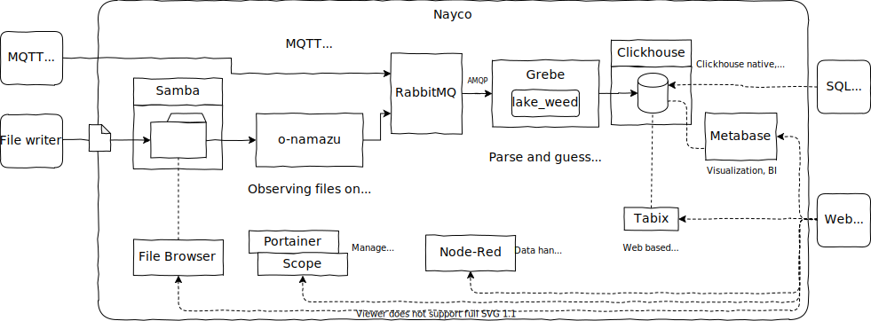

# Nayco

[](https://github.com/tac0x2a/nayco)

Nayco(内湖) is an all in one micro Data Lake for IoT like data.

Please see [Usage.md](/doc/Usage.md) or [Usage.ja.md](/doc/Usage.ja.md)


# Overview


# How to deploy
## Deploy
```sh
$ docker-compose up -d
```

## Shutdown
```sh
$ docker-compose down
```

## Backup
```sh
$ ./backup.sh

-------------------------------------------------
# Contributing
1. Fork it ( https://github.com/tac0x2a/nayco/fork )
2. Create your feature branch (`git checkout -b my-new-feature`)
3. Commit your changes (`git commit -am 'Add some feature'`)
4. Push to the branch (`git push origin my-new-feature`)
5. Create a new Pull Request